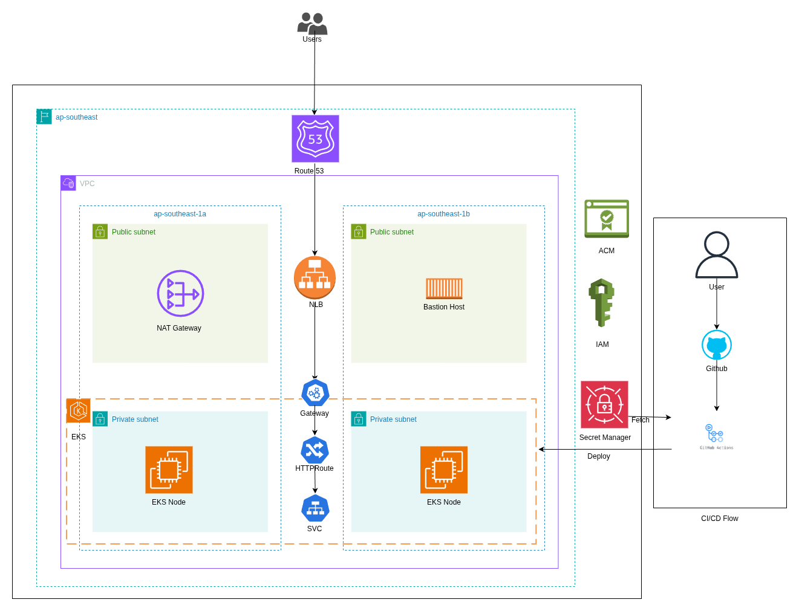

# Node.js Application on AWS EKS - Complete DevOps Solution

[](https://github.com/username/ops-solution/actions)
[](https://github.com/username/ops-solution/actions)
[](https://opensource.org/licenses/MIT)

A production-ready, enterprise-grade DevOps solution showcasing infrastructure as code (IaC), containerization, Kubernetes orchestration, CI/CD automation, and security best practices for deploying a Node.js application on AWS EKS.

## 📋 Table of Contents

- [Overview](#overview)
- [Architecture](#architecture)
- [Features](#features)
- [Technology Stack](#technology-stack)
- [Project Structure](#project-structure)
- [Getting Started](#getting-started)
  - [Prerequisites](#prerequisites)
  - [Quick Start](#quick-start)
- [Infrastructure as Code](#infrastructure-as-code)
- [Kubernetes Deployment](#kubernetes-deployment)
- [CI/CD Pipeline](#cicd-pipeline)
- [Security](#security)
- [Monitoring & Observability](#monitoring--observability)
- [Cost Optimization](#cost-optimization)
- [Branching Strategy](#branching-strategy)
- [Contributing](#contributing)
- [Troubleshooting](#troubleshooting)
- [License](#license)

## 🎯 Overview

This project demonstrates a complete end-to-end DevOps workflow for deploying a simple Node.js REST API application to AWS EKS with enterprise-grade practices:

- **Infrastructure as Code**: Fully automated AWS infrastructure provisioning using Terraform with modular design
- **Policy as Code**: Infrastructure validation and compliance using Open Policy Agent (OPA)
- **Container Orchestration**: Kubernetes deployment using Helm charts with Gateway API
- **CI/CD Automation**: GitHub Actions workflows for continuous integration and deployment
- **Multi-Environment**: Separate configurations for development and production environments
- **Security First**: AWS Secrets Manager integration, IMDSv2, encryption at rest, and security scanning
- **Cost Control**: OPA policies for cost governance and resource optimization

### Application Details

The application is a lightweight Node.js REST API built with Express that provides:
- `GET /` - Welcome endpoint returning JSON response
- `GET /health` - Health check endpoint for readiness/liveness probes

## 🏗️ Architecture



### Infrastructure Components

The architecture consists of the following AWS services:

| Component | Description | Purpose |
|-----------|-------------|---------|
| **VPC** | Custom Virtual Private Cloud | Network isolation with multi-AZ design |
| **Public Subnets** | Internet-facing subnets | Hosts NAT Gateway and bastion host |
| **Private Subnets** | Internal subnets | Hosts EKS worker nodes for security |
| **NAT Gateway** | Network Address Translation | Enables outbound internet access for private subnets |
| **Internet Gateway** | VPC internet connection | Provides internet connectivity |
| **EKS Cluster** | Managed Kubernetes | Container orchestration platform |
| **ECR** | Elastic Container Registry | Private Docker image repository |
| **Secrets Manager** | AWS Secrets Manager | Secure storage for API keys and credentials |
| **Route53** | DNS Service | Domain name resolution |
| **ACM** | AWS Certificate Manager | SSL/TLS certificate management |
| **IAM** | Identity & Access Management | Fine-grained access control |
| **CloudWatch** | Monitoring & Logging | Centralized logging and metrics |

### Network Flow

```
Internet → Route53 → Gateway API (HTTP Route) → Service (ClusterIP) → Pods
                                                                         ↓
                                                              Private Subnets (EKS)
                                                                         ↓
                                                                   NAT Gateway
                                                                         ↓
                                                                 Internet Gateway
```

### Gateway API Architecture

Unlike traditional Ingress controllers, this solution uses **Kubernetes Gateway API** for routing:

- **GatewayClass**: Defines the load balancer implementation
- **Gateway**: Configures listeners and TLS
- **HTTPRoute**: Defines routing rules to backend services

**Benefits over Ingress**:
- Role-oriented design with clear separation of concerns
- Expressive, extensible, and role-oriented API
- Better support for advanced routing scenarios
- Growing community adoption and vendor support

## ✨ Features

### Infrastructure Management
- **Modular Terraform Design**: Reusable modules for VPC, EKS, ECR
- **Multi-Environment Support**: Separate dev and prod configurations
- **Remote State Management**: S3 backend with DynamoDB locking
- **Policy Validation**: OPA policies for compliance and cost control
- **Automated Validation**: Pre-deployment checks in CI/CD

### Application Deployment
- **Helm Charts**: Parameterized Kubernetes deployments
- **Gateway API**: Modern routing with HTTPRoute resources
- **Health Checks**: Startup, liveness, and readiness probes
- **Resource Management**: CPU/memory requests and limits
- **Security Context**: Non-root user, read-only filesystem options

### CI/CD Pipeline
- **Automated Build**: Docker image build and push to registry
- **Testing**: Automated health checks and API tests
- **Registry Caching**: Multi-layer caching for faster builds
- **Atomic Deployments**: Helm atomic upgrades with rollback
- **Secrets Integration**: AWS Secrets Manager integration

### Security
- **Secrets Management**: AWS Secrets Manager for sensitive data
- **Network Security**: Private subnets for workloads
- **IAM Roles**: OIDC-based authentication for GitHub Actions
- **Encryption**: EBS volume encryption with KMS
- **Security Policies**: OPA security policies enforcement
- **Container Security**: Non-root containers, minimal base images

## 🛠️ Technology Stack

### Infrastructure & Cloud
- **Cloud Provider**: AWS
- **IaC Tool**: Terraform >= 1.6.0
- **Policy Engine**: Open Policy Agent (OPA)
- **Container Registry**: GitHub Container Registry (GHCR)

### Application & Runtime
- **Language**: Node.js 18
- **Framework**: Express 4.18
- **Container**: Docker (Alpine-based)
- **Orchestration**: Kubernetes (EKS)

### CI/CD & Automation
- **CI/CD Platform**: GitHub Actions
- **Package Manager**: Helm 3
- **Authentication**: AWS OIDC for GitHub Actions

### Monitoring & Security
- **Logging**: AWS CloudWatch
- **Secrets**: AWS Secrets Manager
- **Networking**: VPC, NAT Gateway, Security Groups

## 📁 Project Structure

```
ops-solution/
├── .github/
│   └── workflows/
│       ├── ci-cd.yml              # Application CI/CD pipeline
│       └── terraform.yml          # Infrastructure CI/CD pipeline
├── docs/
│   └── image/
│       └── architecture.png       # Architecture diagram
├── iac/                           # Infrastructure as Code
│   ├── modules/
│   │   ├── vpc/                   # VPC module
│   │   ├── eks/                   # EKS cluster module
│   │   └── ecr/                   # ECR repository module
│   ├── environment/
│   │   ├── dev/                   # Development environment
│   │   │   ├── main.tf
│   │   │   ├── variables.tf
│   │   │   ├── outputs.tf
│   │   │   └── dev.tfvars
│   │   └── prod/                  # Production environment
│   │       ├── main.tf
│   │       ├── variables.tf
│   │       ├── outputs.tf
│   │       └── prod.tfvars
│   ├── policies/                  # OPA policy files
│   │   ├── terraform.rego         # Terraform best practices
│   │   ├── security.rego          # Security policies
│   │   ├── cost_control.rego      # Cost optimization policies
│   │   └── README.md
│   ├── scripts/
│   │   └── validate-with-opa.sh   # OPA validation script
│   ├── backend-dev.hcl            # Dev backend config
│   ├── backend-prod.hcl           # Prod backend config
│   ├── README.md                  # Infrastructure documentation
│   └── SETUP.md                   # Setup guide
├── kube/                          # Kubernetes manifests
│   ├── helm/                      # Helm chart
│   │   ├── Chart.yaml
│   │   ├── values.yaml
│   │   └── templates/
│   │       ├── deployment.yaml
│   │       ├── service.yaml
│   │       ├── secret.yaml
│   │       └── _helpers.tpl
│   └── k8s/                       # Gateway API resources
│       ├── gatewayclass.yaml
│       ├── gateway.yaml
│       └── httproute.yaml
├── src/                           # Application source code
│   ├── index.js                   # Express application
│   ├── package.json               # Node.js dependencies
│   └── Dockerfile                 # Container definition
└── README.md                      # This file
```

## 🚀 Getting Started

### Prerequisites

Before you begin, ensure you have the following installed and configured:

#### Required Tools
- **AWS CLI** (>= 2.x) - [Installation Guide](https://docs.aws.amazon.com/cli/latest/userguide/getting-started-install.html)
- **Terraform** (>= 1.6.0) - [Installation Guide](https://developer.hashicorp.com/terraform/downloads)
- **kubectl** (>= 1.27) - [Installation Guide](https://kubernetes.io/docs/tasks/tools/)
- **Helm** (>= 3.13) - [Installation Guide](https://helm.sh/docs/intro/install/)
- **OPA** (>= 0.59) - [Installation Guide](https://www.openpolicyagent.org/docs/latest/#running-opa)
- **Docker** (>= 20.x) - [Installation Guide](https://docs.docker.com/get-docker/)

#### AWS Prerequisites
- AWS Account with appropriate permissions
- AWS CLI configured with credentials:
  ```bash
  aws configure
  ```

#### Verify Installation
```bash
# Check versions
terraform version
aws --version
kubectl version --client
helm version
opa version
docker --version
```

### Quick Start

#### 1. Clone the Repository
```bash
git clone https://github.com/username/ops-solution.git
cd ops-solution
```

#### 2. Set Up AWS Backend (One-time setup)
```bash
# Create S3 bucket for Terraform state
aws s3api create-bucket \
  --bucket ops-solution-terraform-state \
  --region ap-southeast-1 \
  --create-bucket-configuration LocationConstraint=ap-southeast-1

# Enable versioning
aws s3api put-bucket-versioning \
  --bucket ops-solution-terraform-state \
  --versioning-configuration Status=Enabled

# Create DynamoDB table for state locking
aws dynamodb create-table \
  --table-name ops-solution-terraform-locks \
  --attribute-definitions AttributeName=LockID,AttributeType=S \
  --key-schema AttributeName=LockID,KeyType=HASH \
  --billing-mode PAY_PER_REQUEST \
  --region ap-southeast-1
```

#### 3. Deploy Infrastructure
```bash
cd iac/environment/dev

# Initialize Terraform
terraform init -backend-config=../../backend-dev.hcl

# Review plan
terraform plan -var-file=dev.tfvars

# Validate with OPA
terraform plan -var-file=dev.tfvars -out=tfplan.binary
terraform show -json tfplan.binary > tfplan.json
../../scripts/validate-with-opa.sh tfplan.json

# Apply
terraform apply -var-file=dev.tfvars
```

#### 4. Configure kubectl
```bash
# Update kubeconfig
aws eks update-kubeconfig \
  --name $(terraform output -raw eks_cluster_name) \
  --region ap-southeast-1

# Verify connection
kubectl get nodes
```

#### 5. Deploy Application
```bash
cd ../../../kube/helm

# Install Gateway API CRDs (if not already installed)
kubectl apply -f https://github.com/kubernetes-sigs/gateway-api/releases/download/v1.0.0/standard-install.yaml

# Deploy with Helm
helm install nodejs-simple-app . \
  --set image.tag=latest \
  --set-string secret.apiKey.value="your-api-key"
```

#### 6. Verify Deployment
```bash
# Check pods
kubectl get pods

# Check gateway and routes
kubectl get gateway
kubectl get httproute

# Test the application
kubectl port-forward svc/nodejs-simple-app 8080:3000
curl http://localhost:8080/health
```

For detailed setup instructions, see [iac/SETUP.md](iac/SETUP.md).

## 🏗️ Infrastructure as Code

### Terraform Modules

The infrastructure is organized into reusable, composable modules:

#### VPC Module
Creates a production-ready VPC with:
- Multi-AZ architecture (2-3 availability zones)
- Public and private subnets
- NAT Gateway for private subnet internet access
- Internet Gateway for public internet connectivity
- Route tables and associations
- VPC Flow Logs for network monitoring

**Key Features**:
- Configurable CIDR blocks
- Automatic subnet calculation
- High availability by default

#### EKS Module
Deploys a managed Kubernetes cluster with:
- EKS control plane
- Managed node groups with auto-scaling
- IRSA (IAM Roles for Service Accounts)
- Cluster add-ons (VPC CNI, kube-proxy, CoreDNS)
- CloudWatch logging integration
- Private/public endpoint configuration

**Security Features**:
- Private endpoint access enabled
- Public access can be restricted in production
- IMDSv2 enforcement
- Encrypted EBS volumes
- Security group with least privilege

#### ECR Module
Provides private container registry:
- Encrypted image storage
- Lifecycle policies for image cleanup
- Cross-account access configuration
- Scan on push for vulnerability detection

### Environment Management

The project supports multiple environments with environment-specific configurations:

| Configuration | Development | Production |
|--------------|-------------|------------|
| VPC CIDR | 10.0.0.0/16 | 10.1.0.0/16 |
| Availability Zones | 2 | 3 |
| Node Count | 2 (min 1, max 4) | 3 (min 2, max 10) |
| Instance Type | t3.medium | t3.large |
| Public Access | Enabled | Disabled |
| Deletion Protection | Disabled | Enabled |

### Policy as Code

OPA (Open Policy Agent) policies enforce compliance and best practices:

#### Terraform Best Practices (`terraform.rego`)
- ✅ Required tags enforcement (Environment, ManagedBy)
- ✅ VPC DNS settings validation
- ✅ EKS security configuration checks
- ✅ Security group rule validation
- ✅ Naming convention enforcement

#### Security Policies (`security.rego`)
- ✅ Encryption at rest (EBS, S3, RDS)
- ✅ IMDSv2 requirement
- ✅ Security group port restrictions
- ✅ Public IP assignment validation
- ✅ IAM trust policy validation

#### Cost Control (`cost_control.rego`)
- ✅ Instance type restrictions per environment
- ✅ Disk size limits
- ✅ Node count limits
- ✅ Cost center tagging requirements

**Running Validation**:
```bash
# Generate plan
terraform plan -var-file=dev.tfvars -out=tfplan.binary
terraform show -json tfplan.binary > tfplan.json

# Validate with OPA
./scripts/validate-with-opa.sh tfplan.json
```

### State Management

Terraform state is stored remotely in S3 with:
- **Versioning**: Enabled for state history
- **Encryption**: AES-256 server-side encryption
- **Locking**: DynamoDB table prevents concurrent modifications
- **Separate States**: Independent state files per environment

## ☸️ Kubernetes Deployment

### Helm Chart

The application is deployed using Helm with the following features:

#### Deployment Configuration
```yaml
replicaCount: 2                    # High availability
image:
  repository: ghcr.io/username/ops-solution
  pullPolicy: IfNotPresent
  tag: "latest"

resources:
  requests:
    cpu: 100m                      # Minimum resources
    memory: 128Mi
  limits:
    cpu: 500m                      # Maximum resources
    memory: 512Mi
```

#### Health Checks
- **Startup Probe**: Allows time for application initialization
- **Liveness Probe**: Restarts unhealthy containers
- **Readiness Probe**: Controls traffic routing to healthy pods

#### Security Context
```yaml
securityContext:
  runAsNonRoot: true               # Don't run as root
  runAsUser: 1001                  # Specific user ID
  allowPrivilegeEscalation: false  # No privilege escalation
  capabilities:
    drop:
      - ALL                        # Drop all capabilities
```

#### Secrets Management
Secrets are fetched from AWS Secrets Manager during deployment and mounted as files:
```yaml
secret:
  apiKey:
    enabled: true
    mountPath: "/etc/secrets"
```

### Gateway API Resources

#### GatewayClass
Defines the controller implementation (e.g., AWS Load Balancer Controller).

#### Gateway
Configures the load balancer with listeners, ports, and TLS settings.

#### HTTPRoute
Routes HTTP traffic to backend services with advanced routing rules:
- Path-based routing
- Header-based routing
- Query parameter matching
- Request/response modification

**Example HTTPRoute**:
```yaml
apiVersion: gateway.networking.k8s.io/v1
kind: HTTPRoute
metadata:
  name: nodejs-app-route
spec:
  parentRefs:
    - name: main-gateway
  rules:
    - matches:
        - path:
            type: PathPrefix
            value: /
      backendRefs:
        - name: nodejs-simple-app
          port: 3000
```

### Deploying Updates

```bash
# Update image
helm upgrade nodejs-simple-app ./kube/helm \
  --set image.tag=v1.2.3 \
  --atomic \
  --wait

# Rollback if needed
helm rollback nodejs-simple-app
```

## 🔄 CI/CD Pipeline

### Application Pipeline (`ci-cd.yml`)

The application pipeline consists of three stages:

#### 1. Build Stage
- Checks out source code
- Sets up Docker Buildx for advanced builds
- Logs into GitHub Container Registry
- Builds Docker image with multi-layer caching:
  - Registry cache for cross-runner efficiency
  - GitHub Actions cache for faster builds
- Pushes image with multiple tags:
  - Branch name (e.g., `main`, `develop`)
  - Git SHA (e.g., `main-abc1234`)
  - `latest` for default branch

**Build Optimization**:
```yaml
cache-from: |
  type=registry,ref=ghcr.io/username/ops-solution:buildcache
  type=gha
cache-to: |
  type=registry,ref=ghcr.io/username/ops-solution:buildcache,mode=max
  type=gha,mode=max
```

#### 2. Test Stage
- Pulls the built image
- Runs container with health checks
- Tests `/health` endpoint (15 attempts with retries)
- Tests `/` API endpoint with response validation
- Cleans up test containers

**Health Check Testing**:
```bash
max_attempts=15
while [ $attempt -lt $max_attempts ]; do
  if curl -f http://localhost:3000/health; then
    echo "✓ Health check passed!"
    break
  fi
  attempt=$((attempt + 1))
  sleep 2
done
```

#### 3. Deploy Stage
- Configures AWS credentials via OIDC
- Fetches secrets from AWS Secrets Manager
- Updates kubeconfig for EKS cluster
- Deploys using Helm with atomic operation:
  - Automatically rolls back on failure
  - Waits for successful rollout
  - Validates pod readiness

**Atomic Deployment**:
```bash
helm upgrade --install nodejs-simple-app . \
  --atomic \
  --cleanup-on-fail \
  --wait \
  --timeout 8m
```

### Infrastructure Pipeline (`terraform.yml`)

#### Plan Stage (All PRs & Pushes)
- Runs for both `dev` and `prod` environments in parallel
- Executes Terraform format check
- Validates Terraform configuration
- Generates execution plan
- Validates plan against OPA policies
- Uploads plan artifacts for apply stage

#### Apply Stage (Main Branch Only)
- Downloads plan artifact from previous stage
- Applies infrastructure changes automatically for `dev`
- Requires manual approval for `prod` (via GitHub Environments)

#### Policy Enforcement
All changes must pass OPA validation:
```bash
# Checks all three policy categories
./scripts/validate-with-opa.sh tfplan.json
# → terraform.rego (best practices)
# → security.rego (security requirements)
# → cost_control.rego (cost governance)
```

### Pipeline Triggers

| Event | Application Pipeline | Infrastructure Pipeline |
|-------|---------------------|------------------------|
| Push to `main` | Build → Test → Deploy | Plan → Apply (dev) |
| Push to `develop` | Build → Test | Plan only |
| Pull Request | Build → Test | Plan both envs |
| Manual Trigger | - | Plan → Apply (selected env) |

### Required GitHub Secrets

Configure these in repository settings → Secrets and variables → Actions:

| Secret Name | Description | Used By |
|-------------|-------------|---------|
| `AWS_ROLE_ARN` | IAM role ARN for dev/staging | Both pipelines |
| `AWS_PROD_ROLE_ARN` | IAM role ARN for production | Infrastructure pipeline |
| `AWS_REGION` | AWS region (e.g., ap-southeast-1) | Both pipelines |
| `SECRET_MANAGER_NAME` | Name of secret in Secrets Manager | Application pipeline |
| `EKS_CLUSTER_NAME` | Name of EKS cluster | Application pipeline |

### Setting Up GitHub OIDC

1. Create OIDC provider in AWS:
```bash
aws iam create-open-id-connect-provider \
  --url https://token.actions.githubusercontent.com \
  --client-id-list sts.amazonaws.com \
  --thumbprint-list 6938fd4d98bab03faadb97b34396831e3780aea1
```

2. Create IAM role with trust policy:
```json
{
  "Version": "2012-10-17",
  "Statement": [{
    "Effect": "Allow",
    "Principal": {
      "Federated": "arn:aws:iam::ACCOUNT_ID:oidc-provider/token.actions.githubusercontent.com"
    },
    "Action": "sts:AssumeRoleWithWebIdentity",
    "Condition": {
      "StringEquals": {
        "token.actions.githubusercontent.com:aud": "sts.amazonaws.com"
      },
      "StringLike": {
        "token.actions.githubusercontent.com:sub": "repo:ORG/REPO:*"
      }
    }
  }]
}
```

## 🔒 Security

This project implements multiple layers of security:

### Infrastructure Security
- ✅ **Network Isolation**: Private subnets for workloads, public subnets only for ingress
- ✅ **Encryption**: EBS volumes encrypted with AWS KMS
- ✅ **IMDSv2**: Enforced on all EC2 instances (prevents SSRF attacks)
- ✅ **Security Groups**: Restrictive ingress/egress rules, no unrestricted SSH
- ✅ **VPC Flow Logs**: Network traffic monitoring and analysis

### Application Security
- ✅ **Non-Root Containers**: Runs as user ID 1001
- ✅ **Minimal Base Image**: Alpine Linux (node:18-alpine)
- ✅ **Dropped Capabilities**: All Linux capabilities dropped
- ✅ **Read-Only Root Filesystem**: Optional hardening
- ✅ **No Privilege Escalation**: Prevents container breakout

### Secrets Management
- ✅ **AWS Secrets Manager**: Centralized secret storage
- ✅ **Rotation Support**: Automatic secret rotation capabilities
- ✅ **Access Control**: IAM policies for secret access
- ✅ **Audit Logging**: CloudTrail logs all secret access
- ✅ **Secret Masking**: Secrets masked in CI/CD logs

### Access Control
- ✅ **IAM Roles**: IRSA for pod-level permissions
- ✅ **RBAC**: Kubernetes role-based access control
- ✅ **OIDC Authentication**: Passwordless CI/CD authentication
- ✅ **Principle of Least Privilege**: Minimal required permissions

### Compliance & Governance
- ✅ **Policy as Code**: OPA policies enforce security requirements
- ✅ **Automated Scanning**: Security validation in CI/CD
- ✅ **Audit Trail**: CloudTrail and CloudWatch logs
- ✅ **Compliance Checks**: Pre-deployment validation

## 📊 Monitoring & Observability

### CloudWatch Integration
- **Container Logs**: Streamed to CloudWatch Logs
- **EKS Control Plane Logs**: API server, audit, authenticator logs
- **Metrics**: CPU, memory, network, disk metrics
- **Alarms**: (To be implemented) Threshold-based alerting

### Application Observability
- **Health Endpoints**: `/health` for monitoring
- **Startup Probes**: Prevents premature traffic routing
- **Liveness Probes**: Automatic unhealthy pod restart
- **Readiness Probes**: Traffic routing to healthy pods only

### Recommended Additions
Consider adding these observability tools:
- **Prometheus**: Metrics collection and storage
- **Grafana**: Metrics visualization and dashboards
- **Fluentd/Fluent Bit**: Log aggregation and forwarding
- **Jaeger/X-Ray**: Distributed tracing
- **Datadog/New Relic**: Full-stack observability (commercial)

## 💰 Cost Optimization

### OPA Cost Policies
Automated cost controls through policy enforcement:

#### Instance Type Restrictions
- **Dev**: Limited to t3.small, t3.medium
- **Prod**: Allows t3.medium, t3.large, m5.large

#### Resource Limits
- **Dev**: Max 30GB EBS volumes, max 4 nodes
- **Prod**: Max 100GB EBS volumes, max 10 nodes

#### Tagging Requirements
- **CostCenter**: Required for cost allocation
- **Environment**: Required for resource tracking

### Infrastructure Optimization
- ✅ **NAT Gateway**: Single NAT Gateway in dev, multiple in prod
- ✅ **Auto Scaling**: Node groups scale based on demand
- ✅ **Spot Instances**: (Can be enabled) Reduce compute costs
- ✅ **Reserved Instances**: (Recommended) For production long-term workloads

### Application Optimization
- ✅ **Resource Limits**: Prevents resource hogging
- ✅ **Horizontal Pod Autoscaling**: (Can be enabled) Scale based on metrics
- ✅ **Vertical Pod Autoscaling**: (Can be enabled) Right-size resources

### Cost Monitoring
```bash
# View costs by tag
aws ce get-cost-and-usage \
  --time-period Start=2024-01-01,End=2024-01-31 \
  --granularity MONTHLY \
  --metrics BlendedCost \
  --group-by Type=TAG,Key=Environment
```

## 🌳 Branching Strategy

This project follows **GitHub Flow** - a simple, branch-based workflow:

### Main Branch
- **Purpose**: Production-ready code
- **Protection**: Requires PR reviews, passing CI checks
- **Auto-Deploy**: Merges to `main` trigger dev deployment
- **Stability**: Always deployable

### Feature Branches
```bash
# Create feature branch
git checkout -b feature/add-authentication
git push -u origin feature/add-authentication

# Create PR when ready
# Merge to main after approval
```

### Hotfix Branches
```bash
# Create hotfix branch
git checkout -b hotfix/fix-health-endpoint
git push -u origin hotfix/fix-health-endpoint

# Create PR with "hotfix" label
# Fast-track review and merge
```

### Branch Naming Convention
- Features: `feature/<description>`
- Bug fixes: `fix/<description>`
- Hotfixes: `hotfix/<description>`
- Documentation: `docs/<description>`
- Infrastructure: `infra/<description>`

### Workflow
1. Create feature branch from `main`
2. Commit changes with descriptive messages
3. Push branch and create Pull Request
4. CI/CD runs automatically:
   - Build and test application
   - Validate Terraform changes
   - Run OPA policy checks
5. Request code review
6. Address review comments
7. Merge to `main` after approval
8. Automatic deployment to dev
9. Manual deployment to prod (via workflow dispatch)

### Commit Message Format
```
<type>(<scope>): <subject>

<body>

<footer>
```

**Types**: `feat`, `fix`, `docs`, `style`, `refactor`, `test`, `chore`

**Example**:
```
feat(api): add authentication middleware

Implements JWT-based authentication for API endpoints.

Closes #123
```

## 🤝 Contributing

We welcome contributions! Please follow these guidelines:

### How to Contribute

1. **Fork the repository**
2. **Create a feature branch** (`git checkout -b feature/amazing-feature`)
3. **Make your changes**:
   - Follow existing code style
   - Add tests if applicable
   - Update documentation
4. **Run local validation**:
   ```bash
   # Terraform
   terraform fmt -recursive
   terraform validate
   
   # Application
   docker build -t test:local ./src
   docker run -p 3000:3000 test:local
   ```
5. **Commit your changes** (`git commit -m 'feat: add amazing feature'`)
6. **Push to your fork** (`git push origin feature/amazing-feature`)
7. **Create a Pull Request**

### Pull Request Checklist
- [ ] Code follows project style guidelines
- [ ] Tests pass locally
- [ ] Documentation updated
- [ ] Terraform formatted (`terraform fmt`)
- [ ] OPA policies validated
- [ ] Commit messages follow convention
- [ ] PR description explains changes

### Code Review Process
1. Automated checks must pass (CI/CD)
2. At least one approval required
3. No unresolved comments
4. Squash and merge preferred

## 🔧 Troubleshooting

### Common Issues

#### 1. Terraform Backend Initialization Fails
```bash
Error: Failed to get existing workspaces: NoSuchBucket
```
**Solution**: Create S3 backend first:
```bash
aws s3api create-bucket --bucket ops-solution-terraform-state --region ap-southeast-1
```

#### 2. OPA Validation Failures
```bash
Error: Policy violation: EKS cluster must have private endpoint access enabled
```
**Solution**: Fix the Terraform configuration and re-run plan:
```bash
# Review policy
cat iac/policies/terraform.rego

# Fix configuration
vim iac/environment/dev/main.tf

# Re-validate
terraform plan -var-file=dev.tfvars -out=tfplan.binary
terraform show -json tfplan.binary > tfplan.json
./scripts/validate-with-opa.sh tfplan.json
```

#### 3. Helm Deployment Fails
```bash
Error: UPGRADE FAILED: pre-upgrade hooks failed
```
**Solution**: Check pod logs and rollback:
```bash
kubectl get pods
kubectl logs <pod-name>
helm rollback nodejs-simple-app
```

#### 4. Health Checks Failing
```bash
Warning: Unhealthy  Readiness probe failed: Get "http://10.0.1.5:3000/health": dial tcp 10.0.1.5:3000: connect: connection refused
```
**Solution**: Verify application is listening on correct port:
```bash
kubectl exec -it <pod-name> -- sh
netstat -tulpn | grep 3000
```

#### 5. Gateway API Not Working
```bash
Error: no matches for kind "HTTPRoute" in version "gateway.networking.k8s.io/v1"
```
**Solution**: Install Gateway API CRDs:
```bash
kubectl apply -f https://github.com/kubernetes-sigs/gateway-api/releases/download/v1.0.0/standard-install.yaml
```

#### 6. AWS OIDC Authentication Fails
```bash
Error: Not authorized to perform sts:AssumeRoleWithWebIdentity
```
**Solution**: Verify IAM role trust policy allows GitHub Actions:
```bash
aws iam get-role --role-name github-actions-terraform-dev
# Check trust policy includes token.actions.githubusercontent.com
```

### Debug Commands

```bash
# Kubernetes
kubectl get all -A
kubectl describe pod <pod-name>
kubectl logs <pod-name> --previous
kubectl get events --sort-by='.lastTimestamp'

# Helm
helm list
helm history nodejs-simple-app
helm get values nodejs-simple-app

# Terraform
terraform show
terraform state list
terraform state show <resource>
TF_LOG=DEBUG terraform plan

# AWS
aws eks describe-cluster --name <cluster-name>
aws sts get-caller-identity
aws logs tail /aws/eks/<cluster-name>/cluster --follow
```

### Getting Help

- **Documentation**: Check [iac/README.md](iac/README.md) and [iac/SETUP.md](iac/SETUP.md)
- **Issues**: Search existing GitHub issues
- **Logs**: Check CloudWatch Logs for detailed errors
- **Community**: AWS EKS, Terraform, and Kubernetes communities

## 📄 License

This project is licensed under the MIT License - see below for details:

```
MIT License

```